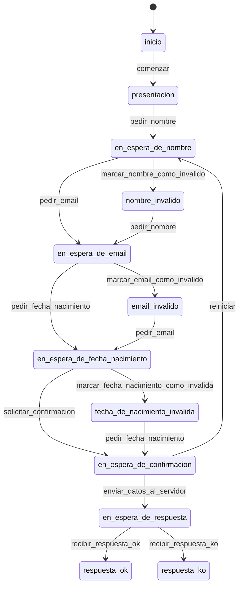

# Signup

Quiero un componente que permita a un usuario darse de alta en mi aplicacion.
Básicamente, recopila todos los datos del usuario, los manda a un servidor y espera una respuesta.

## Datos que recopilo

Nombre
Email
Fecha de nacimiento

Una vez recopilados, me pide confirmación... y al servidor.

Si el servidor me da OK, informo al usuario
Si el servidor me da KO, informo al usuario

Y punto pelota.

Vamos a validar los datos según los vayan metiendo.

# Y en este caso... no vamos a trabajar con un formulario... al estilo tradicional.. QUE ABURRIDO !!!! estamos en 2024. QUE ABURRIDO !!!!

Más adelante vamos a reimplementar este componente mediante un formulario. 

---

# Estados del componente: NOMENCLATURA: Sustantivos o adjetivos

- `inicio`: El estado inicial del componente. No se ha hecho nada.
- `presentacion`: El sistema le informa que se va a dar de alta.
- `en_espera_de_nombre`: El sistema le pide el nombre.
- `nombre_invalido`: El sistema le pide el nombre.
- `en_espera_de_email`: El sistema le pide el email.
- `email_invalido`: El sistema le pide el email.
- `en_espera_de_fecha_nacimiento`: El sistema le pide la fecha de nacimiento.
- `fecha_de_nacimiento_invalida`: El sistema le pide la fecha de nacimiento.
- `en_espera_de_confirmacion`: El sistema le pide confirmación.
- `en_espera_de_respuesta`: El sistema está enviando los datos al servidor.
- `respuesta_ok`: El servidor ha respondido OK.
- `respuesta_ko`: El servidor ha respondido KO.

# Transiciones : NOMENCLATURA: infinitivos

comenzar: inicio -> presentacion
pedir_nombre: PRESENTACION -> EN_ESPERA_DE_NOMBRE
pedir_email: EN_ESPERA_DE_NOMBRE -> EN_ESPERA_DE_EMAIL
pedir_email: NOMBRE_INVALIDO -> EN_ESPERA_DE_EMAIL
pedir_fecha_nacimiento: EN_ESPERA_DE_EMAIL -> EN_ESPERA_DE_FECHA_NACIMIENTO
pedir_fecha_nacimiento: EMAIL_INVALIDO -> EN_ESPERA_DE_FECHA_NACIMIENTO
marcar_nombre_como_invalido: EN_ESPERA_DE_NOMBRE -> NOMBRE_INVALIDO
marcar_email_como_invalido: EN_ESPERA_DE_EMAIL -> EMAIL_INVALIDO
marcar_fecha_nacimiento_como_invalida: EN_ESPERA_DE_FECHA_NACIMIENTO -> FECHA_DE_NACIMIENTO_INVALIDA
solicitar_confirmacion: EN_ESPERA_DE_FECHA_NACIMIENTO -> EN_ESPERA_DE_CONFIRMACION
solicitar_confirmacion: FECHA_DE_NACIMIENTO_INVALIDA -> EN_ESPERA_DE_CONFIRMACION
enviar_datos_al_servidor: EN_ESPERA_DE_CONFIRMACION -> EN_ESPERA_DE_RESPUESTA
recibir_respuesta_ok: EN_ESPERA_DE_RESPUESTA -> RESPUESTA_OK
recibir_respuesta_ko: EN_ESPERA_DE_RESPUESTA -> RESPUESTA_KO

