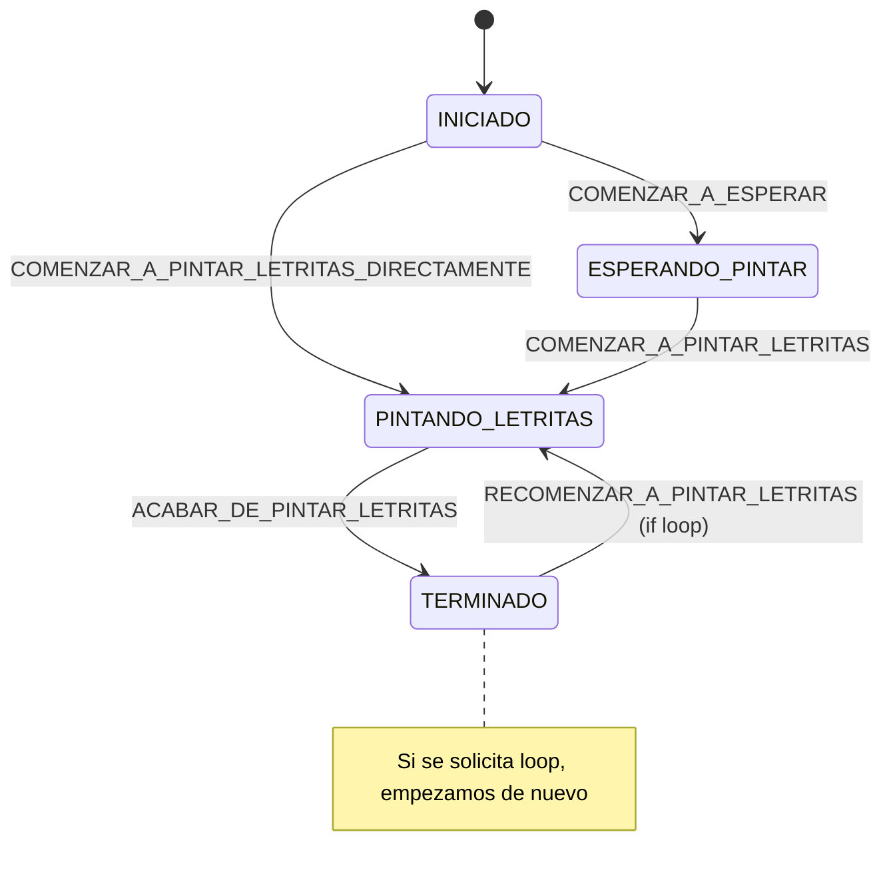

# Typewriter component

Lo que queremos es un componente que nos emule el efecto de una máquina de escribir. Es decir, que vaya escribiendo un texto letra a letra.

```html
<typewriter text="Hola mundo"/>
```
Y en renderización se vería algo así:

```html 
<span>H_</span>
<span>Ho_</span>
<span>Hol_/span>
    ...
<span>Hola mundo</span>
```

## Parámetros

| Nombre                | Tipo      | Descripción                                                       | Obligatorio | Por defecto |
|-----------------------|:---------:|-------------------------------------------------------------------|:-----------:|:-----------:|
| text                  | String    | Texto que se quiere escribir letra a letra.                       | Sí          | -           |
| speed                 | Number    | Velocidad a la que se escribe el texto.                           | No          | 100         |
| textClass             | String    | Clase CSS que se le quiere aplicar al texto                       | No          | -           |
| cursor                | String    | Carácter que se quiere usar como cursor.                          | No          | "_"         |
| cursorBlinkSpeed      | Number    | Velocidad a la que parpadea el cursor.                            | No          | 500         |
| cursorClass           | String    | Clase CSS que se le quiere aplicar al cursor                      | No          | -           |
| hideCursorOnComplete  | Boolean   | Indica si se quiere ocultar el cursor al finalizar la escritura   | No          | false       |
| initialDelay          | Number    | Tiempo de espera antes de empezar a escribir                      | No          | 0           |
| loop                  | Boolean   | Indica si se quiere repetir la escritura una vez finalizada       | No          | false       |

# De cara a enfrentarnos a CUALQUIER COMPONENTE WEB QUE VAYAIS A CREAR AHORA O EN EL FUTURO, SIEMPRE
# QUIERO DECIR : SIEMPREEEE !!!!!!!!! lo primero me planteo su MAQUINA DE ESTADOS !

## En qué estados puede estar este componente? 
 Siempre uso sustantivos/adjetivos. Deben de poder acabar la frase: El componente está: _____

- INICIADO
- ESPERANDO_PINTAR
- PINTANDO_LETRITAS
- TERMINADO

## Transiciones entre estados?

Aqui usamos infinitivos. Deben de poder acabar la frase: El componente puede: _____
- COMENZAR_A_ESPERAR
- COMENZAR_A_PINTAR_LETRITAS_DIRECTAMENTE
- COMENZAR_A_PINTAR_LETRITAS
- ACABAR_DE_PINTAR_LETRITAS
- RECOMENZAR_A_PINTAR_LETRITAS

## Vamos a representar esta máquina de estados:
    


